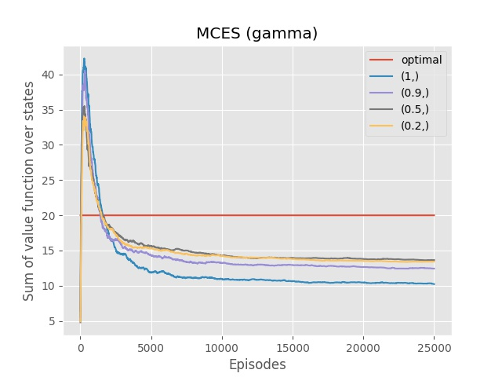
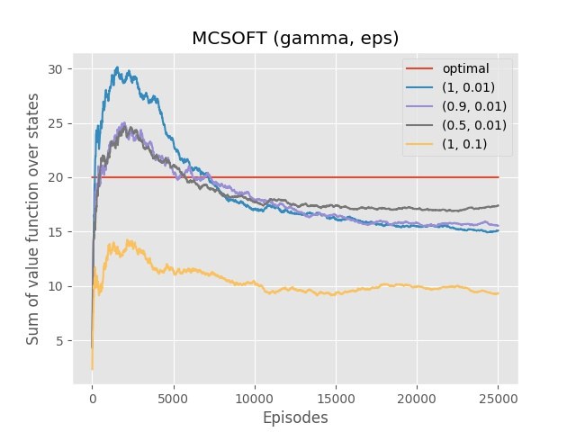
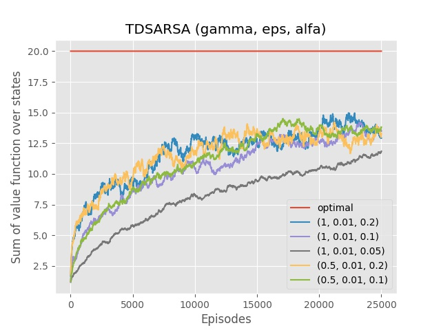
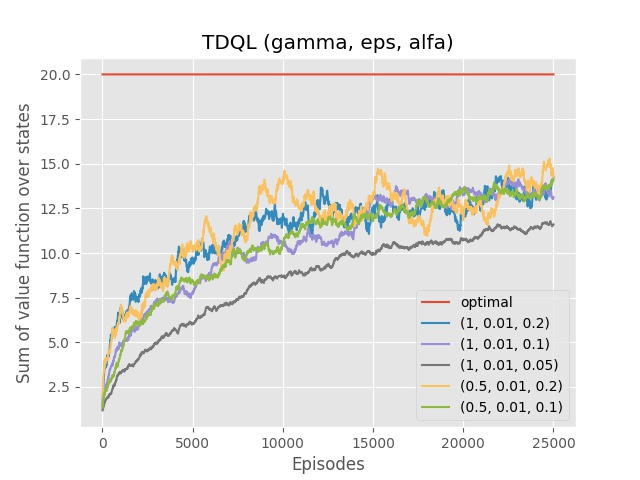
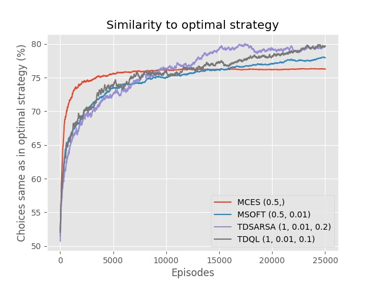
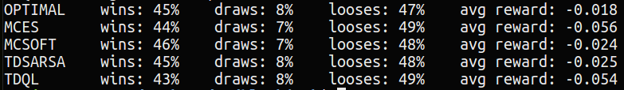

# Blackjack 

Comparison of following reinforcement learning algorithms on instance of Blackjack game:

- Monte Carlo Exploring Starts (MCES)
- Monte Carlo &epsilon;-soft (MCSOFT)
- SARSA (TDSARSA)
- Q-learning (TDQL)

## Results

Here are averaged results (from 20 trainings) of evaluation of algorithms for some tuples of it's parameters. Function used for evaluation at given time t is sum of *v(s)* over all states *s*, where *v* is draw upon estimates of &pi; and *q* at time t. This is kind of poor heuristic, however it's fast and sheds light on how quickly and nearly to optimal strategy algorithms 'stabilize'. Red line represents evaluation of an arbitrary optimal strategy.

Here are best tuples for each algorithm (based on above results):

- MCES: &gamma; = 0.5
- MCSOFT: &gamma; = 0.5, &epsilon; = 0.01
- TDSARSA: &gamma; = 1, &epsilon; = 0.01, &alpha; = 0.2
- TDQL: &gamma; = 1, &epsilon; = 0.01, &alpha; = 0.1

Here is another evaluation of algorithms fed with above tuples. It shows similarity to optimal strategy (percent of shared choices):

Scripts, which generate above graphs:

- algos\_values\_stats.py (first four)
- compare\_to\_optimal.py (last one)

Final evaluation can be done with evaluate.py script. It trains all algorithms with hard-coded parameters for given number of episodes (-e) and simulate some number of games (-v) following computed strategies. Here's example (python3 evaluate.py -e 25000 -v 25000)

